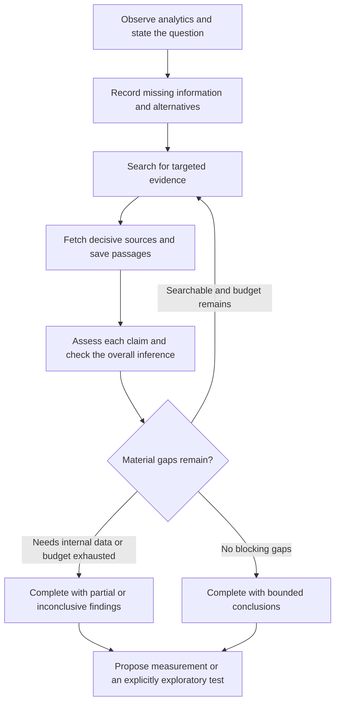

**Research quality: reducing overconfidence in Ceres**

Research date: September 13, 2026. Status: the first production-sized design is implemented in workflow version `state-machine-v2` with evidence policy `evidence-review-v1`. The async Linkup Research endpoint and calibrated probability estimates remain deferred. Evidence consists of a static review of this repository, current Linkup documentation and vendor case studies, and published research. No live Linkup API benchmark was run.

**Recommendation.** Add an evidence review step that connects each important claim to specific source passages, records missing information, searches for competing explanations, and controls how strongly the final answer may state its conclusions. Combine Linkup Search and Fetch with these application rules. Make an inconclusive result a valid completion.

The goal is to answer three questions visibly: What information is missing? What does the evidence actually support? What remains uncertain, and what would resolve it?

**What the project already does, and where overconfidence can enter**

The workflow already has useful safeguards: findings are persisted before follow-up searches; every finding requires assessment; hypotheses cite this run’s analytics and relevant findings; uncertainties and contradictions propagate; provider failures remain explicit; experiments inherit hypothesis uncertainties. Preserve these behaviors. See [workflow](../core/workflow.ts), [instructions](../agent/instructions.md), and [experiments](../core/experiments.ts).

| Current behavior | Remaining weakness | Proposed change |
| --- | --- | --- |
| `findingAssessmentSchema` records relevance, summary, uncertainty, and contradictions. | Relevance does not establish support for a particular claim. Assessments require no quoted passage, publication date, or source classification. | Add claim-to-passage evidence assessments. |
| `saveCandidate()` checks source references and analytics quality. | An agent can supply an unsupported assertion alongside valid source IDs; semantic support is not checked. | Separate reference validation from claim support review. |
| `trust` measures counts, definitions, traceability, sample size, windows, and coverage. | It does not measure web-source reliability or probability that a hypothesis is true. Contradictions do not lower this score. | Display it as “analytics evidence quality”; add separate research status and caveats. |
| A hypothesis can be active when mandatory checks pass and a suggested test exists. | Sample adequacy and web-evidence strength are not activation gates for hypotheses. This allows exploratory hypotheses, but `active` can be misunderstood as confirmed. | Separate currentness, evidence status, and eligibility for an exploratory experiment. |
| One referenced follow-up is mandatory when relevant findings exist and budget allows. | The follow-up need not challenge the preferred explanation. | Require a material gap or counterevidence target before claiming sufficient evidence. |
| `sufficient_evidence` is an agent-selected stop reason when no forced stop applies. | It has no evidence-completeness predicate. Budget exhaustion also still leads toward hypothesis submission. | Validate sufficiency and add completion with an inconclusive research outcome. |
| Uncertainties are appended and deduplicated as strings. | They cannot be explicitly resolved. Final hypothesis uncertainties are truncated to 30, after agent-supplied uncertainties. | Persist structured gaps and preserve critical unresolved items by reference. |
| Deduplication compares an existing finding’s URL and content exactly. | Copies at different URLs can appear to corroborate one another. | Group evidence by original publication or underlying study; track unknown independence. |

These are findings from [contracts](../core/contracts.ts), [validation](../core/validation.ts), and [workflow](../core/workflow.ts). Existing [research tests](../tests/research.test.ts) cover ordering, references, persistence, and provider failures; they do not measure whether generated claims are faithful to source content.

**Linkup use cases worth combining**

The following are vendor-published accounts, useful as architecture examples. They do not independently establish expected accuracy improvements in Ceres or disclose a complete uncertainty-calibration system.

| Use case | Documented approach | Adaptation for Ceres |
| --- | --- | --- |
| Omniscient: reputation and claim verification | A low-credibility signal triggers publisher assessment, external corroboration through Search, and Fetch for deeper source inspection. | Trigger verification when a decisive claim has weak, conflicting, or incomplete evidence. Trace reports to original sources. [Case study](https://www.linkup.so/case-studies/omniscient-reputation-monitoring) |
| Boulanger: support with incomplete internal knowledge | Evaluate whether internal knowledge answers the question; route gaps to web search with source prioritization. | Classify missing information before searching. Public product facts may be searchable; missing internal funnel events require instrumentation or user input. [Case study](https://www.linkup.so/case-studies/retrieves-live-user-feedback-market-insights-chatbots) |
| Legora: complex research | Search and Fetch support broader source coverage and more complete answers across legal systems. | Check coverage of necessary dimensions, rather than stopping after finding one plausible explanation. [Case study](https://www.linkup.so/case-studies/delivers-up-to-date-web-data-legal-ai) |
| Artisan: company enrichment | Standard searches provide initial context; deeper enrichment runs progressively in the background. | Escalate expensive retrieval only for unresolved questions that could change the recommendation. Label interim conclusions provisional. [Case study](https://www.linkup.so/case-studies/sales-enablement-enriched-pipeline-real-time-intent) |

My recommended combination is Boulanger’s gap routing, Omniscient’s targeted verification, and Artisan’s selective escalation. Legora’s coverage emphasis provides an additional completeness check. This combination is a proposed adaptation, not a documented joint implementation.

**What Linkup supplies, and what Ceres must decide**

Linkup Search offers `standard` and `deep` retrieval, raw `searchResults`, sourced answers, structured output, domain filters, and date bounds. Ceres currently uses only `standard` with `searchResults`. Keep raw evidence available; generated answers and valid JSON should not be accepted as proof by themselves. [Search API](https://docs.linkup.so/pages/documentation/endpoints/search/reference)

Linkup’s search guidance emphasizes named research dimensions and explicit extraction targets. It describes deep mode as iterative search that can discover and read multiple URLs. Use this to investigate a concrete unresolved question rather than simply requesting “more confidence.” [Search best practices](https://docs.linkup.so/pages/documentation/endpoints/search/best-practices)

Fetch retrieves a known page as markdown and supports optional structured extraction. Its documentation says fields without grounded values are omitted, even if marked required. Ceres should preserve the distinction between a missing field and a negative finding, and handle omissions without inventing a default. Retain the underlying passage and retrieval status. Fetch does not follow links or authenticate into private pages. [Fetch overview](https://docs.linkup.so/pages/documentation/endpoints/fetch/overview)

The separate Research endpoint supports focused investigations, precise answers, and broader reports, with iterative cross-checking and citations. It is asynchronous and may take minutes. It would require persisted job state, polling, and separate failure handling; it cannot simply replace the current synchronous adapter call. Consider it after the smaller Search/Fetch design is evaluated. [Research overview](https://docs.linkup.so/pages/documentation/endpoints/research/overview)

I did not find a documented, calibrated probability-of-truth output or a complete misinformation guarantee in the endpoint documentation reviewed. Linkup’s retrieval and verification features can improve the evidence available to Ceres; the application still needs acceptance rules and its own evaluation.

**Research findings that inform the design**

| Research | Useful finding | Application and limitation |
| --- | --- | --- |
| [FEVER, 2018](https://aclanthology.org/N18-1074/) | Claims are labeled supported, refuted, or not enough information, with evidence for supported/refuted judgments. | Use explicit evidence outcomes. Add `mixed` for unresolved conflicting evidence. An unsuccessful search does not refute a claim. |
| [FActScore, 2023](https://aclanthology.org/2023.emnlp-main.741/) | Long answers can contain a mixture of supported and unsupported atomic facts. | Review individual factual claims and citation coverage. Its biography evaluations do not validate marketing causality. |
| [Chain-of-Verification, 2024](https://aclanthology.org/2024.findings-acl.212/) | Separating verification questions and answers from the initial draft reduces hallucinations in evaluated tasks. | Check key claims in a separate pass, preferably using newly retrieved evidence. Asking the same model to agree with itself is weak verification. |
| [Uncertainty calibration, NeurIPS 2024](https://arxiv.org/abs/2406.08391) | The authors find prompting alone insufficient for good calibration and improve estimates using graded examples and training. | Avoid invented “85% confident” scores. Start with observable evidence states; validate any later probability estimates on held-out data. |
| [Semantic entropy, Nature 2024](https://www.nature.com/articles/s41586-024-07421-0) | Variation in meaning across sampled answers helps detect a class of hallucinations termed confabulations. | A possible later review trigger. It requires extra generations and cannot establish truth when answers are consistently wrong. |
| [Long-Form Information Alignment, EMNLP 2025](https://aclanthology.org/2025.emnlp-main.558/) | Individually true facts can be assembled into misleading narratives. | Also check the connection between facts: time order, population, and causal implications. Atomic citation checks alone are insufficient. |

The implemented controls below are engineering judgments informed by this research, not experimentally validated accuracy improvements to Ceres.

**Proposed workflow**

1. **Record gaps before searching.** For each gap, save its question, affected claims, importance, resolution method, and status. Resolution methods should include `web_search`, `internal_analytics`, `product_inspection`, and `experiment`. Example: “Does the current signup form require unnecessary fields?” needs inspection; general conversion advice cannot resolve it. Resolve a gap only by attaching new evidence, and retain its history.

2. **Separate claims by role.** Use `observation`, `external_fact`, `inference`, and `assumption`. “One of three eligible visitors converted” is an observation. “Form friction caused this result” is a causal inference. “The form has many fields” is an assumption until the product is inspected. Verification must not silently upgrade one role to another.

3. **Connect each external fact to passages.** Store the source ID and version, supporting or contradicting passage, source type, publication date when known, retrieval time, entity, and population. Permit `supported`, `refuted`, `mixed`, and `insufficient_evidence`. Treat `not_checked` and `retrieval_failed` as review states, not truth judgments. Source support means the document supports the statement; it does not establish that the document is correct.

4. **Check source quality and independence.** Prefer direct evidence for the exact claim: official documentation for product behavior, original research for study outcomes, and internal events for the project’s conversion counts. A vendor can substantiate what it advertises without substantiating comparative effectiveness. Several articles citing one study count as one evidence origin. Do not treat page popularity or domain allowlisting as proof.

5. **Challenge the preferred explanation.** Before selecting sufficient evidence, investigate an alternative that could change the decision. For example: “Find evidence on whether required signup fields affect account creation, including null results, qualification tradeoffs, and differences between visitor populations. Identify original studies and limitations.” A contradictory but relevant source remains eligible evidence. Avoid creating false balance when one position has substantially stronger evidence.

6. **Apply a completion policy.** Classify the run as `supported`, `partial`, or `inconclusive` separately from why retrieval stopped. `sufficient_evidence` requires review of every decisive factual claim, resolved blocking gaps, and no unaddressed decisive contradiction. Budget exhaustion or provider failure cannot satisfy that predicate. Exploratory hypotheses may still be saved with explicit assumptions and measurement steps; no outcome should require fabrication of a causal explanation.

7. **Generate a bounded answer.** Present observations, interpretation, unresolved questions, and the next useful action. Cite factual claims beside their sources. Explain uncertainty in operational terms: “We do not have form-interaction events; collect them to distinguish abandonment from low intent.” Check the final wording against the approved evidence, including whether it implies causality or generalizes beyond the observed population.

**Implemented first version**

The first version uses the existing outer agent for semantic judgments while the server validates evidence references, exact passage matching, required fields, budgets, completion rules, and state transitions. Search and Fetch are implemented. Semantic support, source authority, and independence remain model assessments; deterministic validation cannot prove entailment or truth.

| Location | Proposed change |
| --- | --- |
| [core/contracts.ts](../core/contracts.ts) | Implements versioned claim, evidence-assessment, gap, and validated Search-option schemas. Unknown dates and missing values remain explicit. |
| [core/workflow.ts](../core/workflow.ts) | Implements planning, claim review, exact passage checks, gap-linked resolution, sufficiency validation, empty-result reformulation, and completion without a hypothesis. |
| [adapters/linkup.ts](../adapters/linkup.ts) | Implements validated standard/deep Search options, domain and date filters, and a separate Fetch method with response-size limits. Fetch failures are recorded by the workflow. |
| [core/validation.ts](../core/validation.ts) | Retains the separate analytics validation score. The versioned research policy is implemented in the workflow and persisted as `research_assessment`. |
| [core/experiments.ts](../core/experiments.ts) | Inherits structured claims, evidence, gaps, and research status. Partial or inconclusive work requires exploratory intent and prerequisites. |
| [agent/instructions.md](../agent/instructions.md) | Requires claim roles, passage support, counterevidence, and proportionate final wording. |
| [agent/tools/read_records.ts](../agent/tools/read_records.ts) | Exposes claims, gaps, fetched documents, evidence assessments, research assessments, and conclusions. |
| [scripts/seed.ts](../scripts/seed.ts) | Adds clearly synthetic examples of mixed evidence and inconclusive completion. |

The generic `kind` and JSONB `snapshot` in [003_document_store.sql](../migrations/003_document_store.sql) can already store additional record kinds. A new table is not necessary for this initial design. Add application schema versions and treat old findings as unreviewed rather than automatically verified. Store fetched documents separately and link them to claims: the PostgreSQL adapter has a 500,000-character serialized-body limit, and repeatedly embedding full documents would increase record size.

The sample budget is three searches. A starting allocation is discovery, the highest-value gap or counterevidence search, and optional escalation. Add a separate small Fetch budget, such as two decisive pages, with cache reuse by source version. These are proposed starting limits, not measured optima. Do not spend all remaining calls on public-web questions when the decisive gap requires internal data.

**Example of the desired answer**

Using the repository’s synthetic sample and its 48-hour metric:

> Search has 2 account creations among 3 eligible visitors for September 7–10, 2026. This is a small, overlapping sample and does not establish a channel problem or its cause. Signup friction is an explanation worth investigating, but we have not inspected the form or measured form abandonment. First check the current signup steps and collect start, error, and completion events. If unnecessary fields are present, an exploratory field-reduction test could evaluate that hypothesis. Research status: insufficient evidence to identify the cause.

This example does not claim that external research established friction. In a real run, any external factual statement would need its own supporting passage and citation.

**How to evaluate improvement**

Create a small human-labeled set of roughly 30–50 scenarios, using frozen source snapshots for reproducibility. Include supported claims, irrelevant citations, reversed numerical claims, stale facts, conflicting evidence, syndicated copies, missing internal data, incomplete pages, provider failures, unsupported causal language, and instructions embedded in retrieved pages. Keep supported cases so an agent that always refuses does not appear successful.

Compare the current workflow, instruction-only changes, and structured review with retrieval improvements on the same scenarios. Keep held-out cases separate from prompts and policy tuning. Repeat selected generation cases to expose variability. Use model grading for triage only, with human review of important decisions and disputed labels.

| Quality question | Measure |
| --- | --- |
| Does it find missing information? | Recall of human-labeled material gaps, plus precision to penalize irrelevant caveats. |
| Does it check evidence? | Citation correctness: fraction of cited claims supported by their passages. Citation completeness: fraction of externally checkable factual claims with adequate support. |
| Does it flag uncertainty? | Fraction of unresolved decisive claims presented as established facts; correct recognition of mixed and insufficient evidence. |
| Does it avoid unnecessary refusal? | Coverage of answerable questions, reported alongside error rate among answered questions. |
| Does it catch misinformation? | Refuted claims accepted as supported; missed contradictions; duplicated origins incorrectly counted as corroboration. |
| Does it preserve limitations? | Critical gaps retained through hypothesis, experiment, and final response. |
| Is the tradeoff worthwhile? | Provider calls, fetches, latency, and cost per accepted answer. |

Proposed release criteria are zero unsupported causal assertions and zero lost critical caveats on the curated regression set, with improved citation accuracy and no material collapse in answer coverage. These are acceptance targets, not achieved results or guarantees beyond the test set. If probabilities are introduced later, assess calibration with held-out correctness labels, Brier score, and reliability plots; a small demo dataset cannot justify precise confidence percentages.

The first implementation should prioritize claim-to-passage checks, structured gaps, and inconclusive completion. Those changes directly address the current path from a relevant finding to an apparently supported recommendation. Deeper retrieval and additional model passes should earn their place through evaluation.
