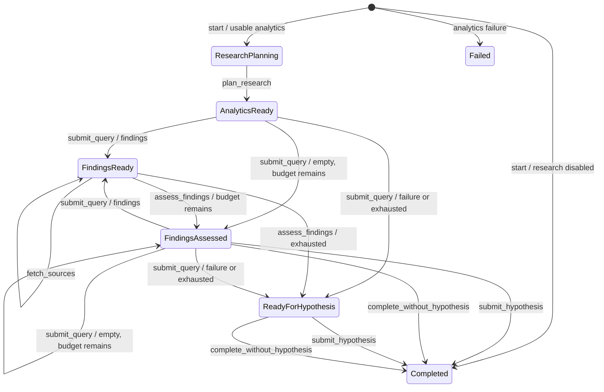

# Analysis workflow

`AnalysisWorkflow` is a persisted, server-enforced evidence-review state machine. A client submits one action at a time with the current `run_id` and `state_version`. The workflow validates the action, performs any persistence or Linkup operation, saves a new state revision, and returns the permitted `next_actions`.

| State | Meaning | Typical next actions |
| --- | --- | --- |
| `research_planning` | Analytics exist; atomic claims and missing-information gaps must be persisted. | `plan_research` |
| `analytics_ready` | The plan exists and an initial gap-directed query can run. | `submit_query` |
| `findings_ready` | Every pending result needs assessment; decisive pages may be fetched first. | `fetch_sources`, `assess_findings` |
| `findings_assessed` | The batch is reviewed. More research, a bounded hypothesis, or an inconclusive completion may follow. | `submit_query`, `submit_hypothesis`, `complete_without_hypothesis` |
| `ready_for_hypothesis` | A provider outcome or budget ended retrieval. | `submit_hypothesis`, `complete_without_hypothesis` |
| `completed` | The run has a hypothesis or a research conclusion and no further actions. | none |

The research plan assigns each claim a role: `observation`, `external_fact`, `inference`, or `assumption`. Observations must exactly match and cite one of the run's server-generated insights; other roles begin without a source. Every plan needs a decisive research claim beyond the observation. Gaps record affected claims, importance, resolution method, and purpose. Every plan also needs a web-search `challenge` gap tied to a decisive research claim so a preferred explanation cannot satisfy the completion policy without a counterevidence search.

Searches must reference open `web_search` gaps. An initial search cannot cite findings. Once a relevant finding exists, the mandatory first follow-up cites one. If the first result set is empty or all results are irrelevant, the agent can reformulate against the same open gap while budget remains. Each search may choose validated `standard` or `deep` depth and optional include-domain, exclude-domain, and date filters; the chosen options are saved in the decision and provider-attempt records.

`fetch_sources` retrieves full page text for selected pending findings. Search and Fetch have separate configured budgets. Fetch failures are recorded and do not prevent assessment of an available search excerpt.

Every pending finding is assessed exactly once. Relevant findings require claim-level evidence. A supported, refuted, or mixed verdict must include an exact passage contained in the saved search result or its related fetched document. The server validates this reference and substring relationship; the model still supplies the semantic judgment, source type, publication date, original-source identity, and independence assessment. A gap can only be resolved with new evidence retrieved for that gap.

Research status is separate from the stop reason and from the existing analytics `trust` score:

- `supported` requires every decisive claim to be supported, no open blocking gap, and a challenge gap that was both searched and resolved.
- `partial` means the run contains reviewed evidence but does not satisfy all supported requirements.
- `inconclusive` means no reviewed evidence supports a bounded conclusion.
- `not_requested` is used only for analytics-only runs where web research was disabled.

`sufficient_evidence` is accepted only for `supported` research. Provider failure, empty results, and budget exhaustion cannot imply sufficiency. `complete_without_hypothesis` persists an honest conclusion when no useful hypothesis is justified. A partial or inconclusive hypothesis is marked for exploratory experiments; confirmatory experiment intent requires supported research.

All claims, gaps, fetched documents, evidence assessments, overall research assessments, conclusions, findings, decisions, provider attempts, and state revisions use the generic document store. PostgreSQL commits each document revision atomically. A whole workflow transition and its provider calls are not a single database transaction, so the in-process transition lock and optimistic state version remain important.
