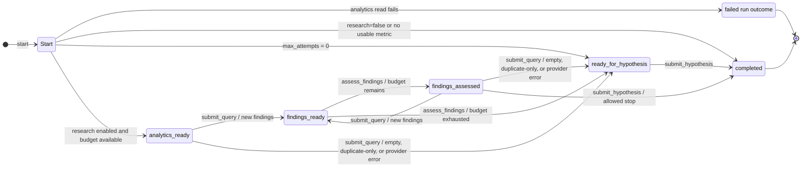

# Analysis workflow

Yes. The analysis workflow is implemented as a persisted, server-enforced state machine. A client submits one action at a time to `AnalysisWorkflow.transition()`. The workflow loads the current `workflow_state`, validates that the action is legal for its `phase`, performs the work, saves a new state version, and returns `next_actions`.

The state-machine model applies to `AnalysisWorkflow`; it is not necessarily a property of every workflow in the codebase. Some transitions also perform side effects—reading analytics, querying Linkup, and saving evidence—so this is a stateful workflow orchestrator rather than a pure in-memory finite-state machine.

## What each state means

| State | Meaning | Returned next actions |
| --- | --- | --- |
| `analytics_ready` | Analytics and derived insights are saved; an initial research query can be made. | `submit_query` |
| `findings_ready` | A query returned new findings, and every pending finding must be assessed. | `assess_findings` |
| `findings_assessed` | The latest batch is assessed. More research may be possible; a hypothesis is offered only when the follow-up rule permits it. | `submit_query`, sometimes `submit_hypothesis` |
| `ready_for_hypothesis` | Research cannot or should not continue because of a forced stop condition. | `submit_hypothesis` |
| `completed` | The run is finalized and has no further actions. | none |

`failed` is a terminal run result when initial analytics processing throws; it is not one of the persisted `Phase` values.

## Important guards

- Every action after `start` must include the returned `run_id` and `state_version` as `expected_version`. A stale version is rejected.
- The initial query must have an empty `based_on_ids`. A follow-up query must cite at least one assessed, relevant finding from the same run.
- Every pending finding must be assessed exactly once before another query or a hypothesis.
- If an initial assessment produces a relevant finding and the budget allows two attempts, one referenced follow-up query is mandatory.
- A hypothesis must cite the run's analytics. If relevant findings exist, it must also cite at least one of them.
- Repeated queries, exhausted budgets, invalid action ordering, unknown evidence, and cross-run evidence are rejected.

## Stop reasons

The workflow can enforce `analytics_only`, `budget_reached`, `empty_results`, `diminishing_value`, or `provider_error`. When it has not already enforced a reason, hypothesis submission must choose either `sufficient_evidence` or `diminishing_value`.

Transitions through one `AnalysisWorkflow` instance are serialized in-process, while optimistic version checks protect the persisted state. The file store also records append-only revisions and idempotency keys. Together, these make the workflow auditable and prevent two callers using the same state version through that workflow instance from both advancing a run.

When `DATABASE_URL` is set, the runtime uses PostgreSQL for every record, including insights created by `start`, findings saved by `submit_query` and revised by `assess_findings`, and hypotheses saved by `submit_hypothesis`. Analytics-only runs save insights but do not submit a hypothesis. Run `npm run db:migrate` before using this backend. The Postgres store commits each document and its revision atomically, serializes operation retries, and rejects conflicting document versions. A whole workflow transition and its external provider call are not a single database transaction; transition serialization still applies within one workflow instance.
